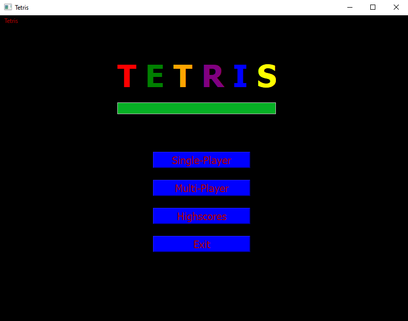

# TetrisQt with Multiplayer

## Game modes

### Menu:

### Singleplayer:

* left: A-Key
* right: D-Key
* down: S-Key
* rotate-right: E-Key
* rotate-left: Q-Key

### Multiplayer

#### Player One:

* left: A-Key
* right: D-Key
* down: S-Key
* rotate-right: E-Key
* rotate-left: Q-Key

#### Player Two:

* left: J-Key
* right: L-Key
* down: K-Key
* rotate-right: O-Key
* rotate-left: U-Key

The multiplayer mode has a competitive component. If one player completes a certain amount of lines the other one will get a line inserted from the bottom.

## Work distribution

* Signals and Slots (Marc)

* Threading (Felix)

* Multiplayer(Felix)

* Field visualization and next piece visuals (Matthias)

* Highscores (Marc)

* Git (Felix)

* Original program (https://github.com/FelixWeichselgartner/Tetris/tree/Cli, Matthias, Marc, Felix)
